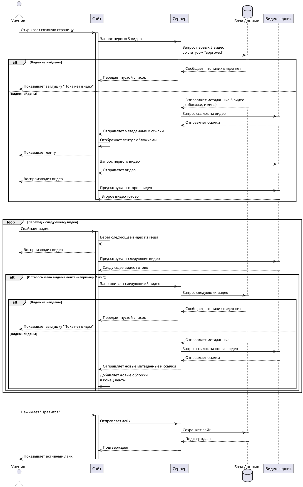

#Диаграмма последовательности

```plantuml

@startuml
' Диаграмма последовательности: Просмотр ленты видео-визиток

actor "Ученик" as u
participant "Сайт" as site
participant "Сервер" as s
database "База Данных" as db
participant "Видео-сервис" as v


u -> site: Открывает главную страницу
activate site

site -> s: Запрос первых 5 видео
activate s

s -> db: Запрос первых 5 видео\nсо статусом "approved"
activate db

alt Видео не найдены
db-->s: Сообщает, что таких видео нет
s -->site: Передает пустой список
site --> u: Показывает заглушку "Пока нет видео"
else Видео найдены
db --> s: Отправляет метаданные 5 видео\n(обложки, имена)
deactivate db

s -> v: Запрос ссылок на видео
activate v
v --> s: Отправляет ссылки
deactivate v

s --> site: Отправляет метаданные и ссылки
deactivate s

site -> site: Отображает ленту с обложками
site --> u: Показывает ленту

site -> v: Запрос первого видео
activate v
v --> site: Отправляет видео
deactivate v

site --> u: Воспроизводит видео

site -> v: Предзагружает второе видео
activate v
v --> site: Второе видео готово
deactivate v

deactivate site

end


|||
|||

loop Переход к следующему видео
u -> site: Свайпает видео
activate site

site -> site: Берет следующее видео из кэша
site --> u: Воспроизводит видео

site -> v: Предзагружает следующее видео
activate v
v --> site: Следующее видео готово
deactivate v


alt Осталось мало видео в ленте (например, 2 из 5)
site -> s: Запрашивает следующие 5 видео
activate s

s -> db: Запрос следующих видео
activate db

alt Видео не найдены
db-->s: Сообщает, что таких видео нет
s -->site: Передает пустой список
site --> u: Показывает заглушку "Пока нет видео"
else Видео найдены
db --> s: Отправляет метаданные
deactivate db

s -> v: Запрос ссылок на новые видео
activate v
v --> s: Отправляет ссылки
deactivate v

s --> site: Отправляет новые метаданные и ссылки
deactivate s

site -> site: Добавляет новые обложки\nв конец ленты
end

deactivate site
end
end


|||
|||

u -> site: Нажимает "Нравится"
activate site
site -> s: Отправляет лайк
activate s
s -> db: Сохраняет лайк
activate db
db --> s: Подтверждает
deactivate db
s --> site: Подтверждает
deactivate s
site --> u: Показывает активный лайк
deactivate site

@enduml

```

