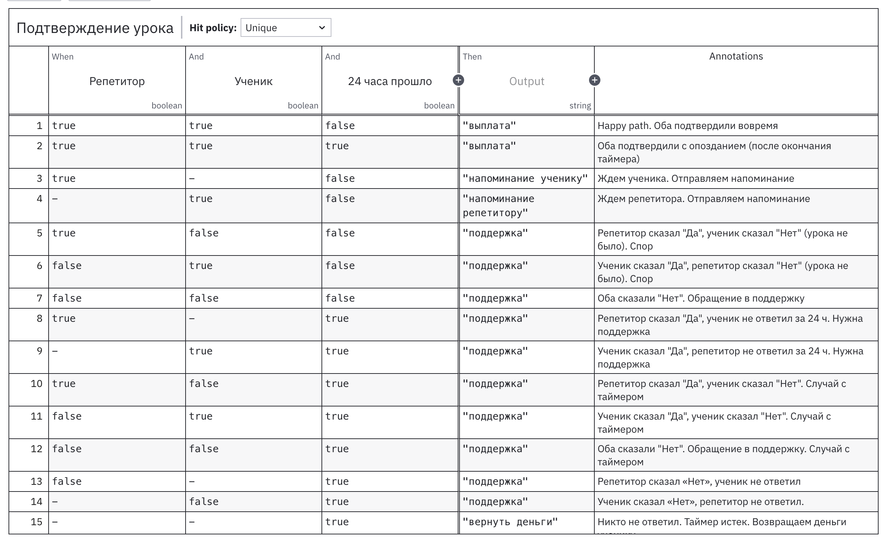

#Бизнес-процесс (BPMN)

#### Бизнес-процесс: проведение первого урока через платформу для поиска репетиторов

1. BPMN 

[https://stormbpmn.com/app/diagram/464f7c8d-826c-46bf-a81b-c8fa8201dfc1?overlays=eyJ2aXNpYmxlIjp7ImFzc2lnbmVlcyI6dHJ1ZSwiY29tbWVudHMiOnRydWUsImRlc2NyaXB0aW9uIjp0cnVlLCJkb2N1bWVudHMiOnRydWUsImR1cmF0aW9uIjp0cnVlLCJpbmNvbWluZ0xpbmtzIjp0cnVlLCJsaW5rcyI6dHJ1ZSwicG9zaXRpb25zIjp0cnVlLCJzeXN0ZW1zIjp0cnVlLCJjdXN0b20iOnRydWUsImlzVXNlclNldHRpbmdzIjp0cnVlLCJjb2xsYXBzZSI6eyJzeXN0ZW1zIjp0cnVlLCJkb2N1bWVudHMiOnRydWUsImN1c3RvbSI6dHJ1ZX19LCJjb2xsYXBzIjp7InN5c3RlbXMiOnRydWUsImRvY3VtZW50cyI6dHJ1ZSwiY3VzdG9tIjp0cnVlfX0%3D](https://stormbpmn.com/app/diagram/464f7c8d-826c-46bf-a81b-c8fa8201dfc1?overlays=eyJ2aXNpYmxlIjp7ImFzc2lnbmVlcyI6dHJ1ZSwiY29tbWVudHMiOnRydWUsImRlc2NyaXB0aW9uIjp0cnVlLCJkb2N1bWVudHMiOnRydWUsImR1cmF0aW9uIjp0cnVlLCJpbmNvbWluZ0xpbmtzIjp0cnVlLCJsaW5rcyI6dHJ1ZSwicG9zaXRpb25zIjp0cnVlLCJzeXN0ZW1zIjp0cnVlLCJjdXN0b20iOnRydWUsImlzVXNlclNldHRpbmdzIjp0cnVlLCJjb2xsYXBzZSI6eyJzeXN0ZW1zIjp0cnVlLCJkb2N1bWVudHMiOnRydWUsImN1c3RvbSI6dHJ1ZX19LCJjb2xsYXBzIjp7InN5c3RlbXMiOnRydWUsImRvY3VtZW50cyI6dHJ1ZSwiY3VzdG9tIjp0cnVlfX0%3D)

1. В свою BPMN-диаграмму я внедрила модель принятия решений DMN «Проверить подтверждение урока».

Использование DMN в моем случае позволяет сделать BPMN более читабельной и менее громоздкой. Для того чтобы проверить подтверждение урока, нужно учесть 3 условия:

- подтвердил ли репетитор урок

- подтвердил ли ученик урок

- прошло ли 24 часа с момента отправки ссылки на урок

Значения входных данных:

**Репетитор / Ученик**:

- true - пользователь нажал «Да» (подтвердил, что урок был)

- false  - пользователь нажал «Нет» (сообщил, что урок не состоялся)

null  (—) - пользователь ещё не ответил.

**Таймер 24ч**:

- true - 24 часа с момента запуска таймера истекли.

- false - 24 часа ещё не прошли.

Комбинация этих трех условий дает 15 различных ситуаций, для каждой нужно свое решение. Например:

- Если оба подтвердили - выплата репетитору

- Если один подтвердил, а второй еще не ответил - напоминание

- Если мнения сторон расходятся - обращение в поддержку

- Если никто не ответил за 24 часа - возврат денег ученику

Если бы я стала отображать эту проверку только с помощью BPMN, потребовался бы ****каскад из множества вложенных шлюзов, ****что сделало бы диаграмму трудноподдерживаемой. 

Поэтому я вынесла всю логику принятия решения в отдельную DMN-таблицу. В ней все 15 правил собраны в одном месте, их легко читать, изменять и тестировать независимо от основного процесса. Благодаря этому BPMN-диаграмма остается понятной и аккуратной, а логика принятия решений вынесена в отдельный инструмент.

DMN:



XML-код: 

```xml

<?xml version="1.0" encoding="UTF-8"?>

<definitions xmlns="https://www.omg.org/spec/DMN/20191111/MODEL/" xmlns:dmndi="https://www.omg.org/spec/DMN/20191111/DMNDI/" xmlns:dc="http://www.omg.org/spec/DMN/20180521/DC/" xmlns:modeler="http://camunda.org/schema/modeler/1.0" xmlns:di="http://www.omg.org/spec/DMN/20180521/DI/" id="Definitions_1baqwc6" name="DRD" namespace="http://camunda.org/schema/1.0/dmn" exporter="Camunda Modeler" exporterVersion="5.44.0" modeler:executionPlatform="Camunda Cloud" modeler:executionPlatformVersion="8.8.0">
  <decision id="Decision_06lwmsb" name="Подтверждение урока">
    <informationRequirement id="InformationRequirement_0tqs87o">
      <requiredInput href="#InputData_1uxinof" />
    </informationRequirement>
    <informationRequirement id="InformationRequirement_0vb501l">
      <requiredInput href="#InputData_07efqtt" />
    </informationRequirement>
    <informationRequirement id="InformationRequirement_0h0h6k6">
      <requiredInput href="#InputData_09x09h5" />
    </informationRequirement>
    <decisionTable id="DecisionTable_0fi2ivb">
      <input id="Input_1" label="Репетитор">
        <inputExpression id="InputExpression_1" typeRef="boolean">
          <text></text>
        </inputExpression>
      </input>
      <input id="InputClause_11sumtu" label="Ученик">
        <inputExpression id="LiteralExpression_0enk850" typeRef="boolean">
          <text></text>
        </inputExpression>
      </input>
      <input id="InputClause_0gqyic6" label="24 часа прошло">
        <inputExpression id="LiteralExpression_159kpcr" typeRef="boolean">
          <text></text>
        </inputExpression>
      </input>
      <output id="Output_1" typeRef="string" />
      <rule id="DecisionRule_1brnxf9">
        <description>Happy path. Оба подтвердили вовремя</description>
        <inputEntry id="UnaryTests_02qhxqf">
          <text>true</text>
        </inputEntry>
        <inputEntry id="UnaryTests_1dt69fx">
          <text>true</text>
        </inputEntry>
        <inputEntry id="UnaryTests_1u03u8l">
          <text>false</text>
        </inputEntry>
        <outputEntry id="LiteralExpression_0daaalf">
          <text>"выплата"</text>
        </outputEntry>
      </rule>
      <rule id="DecisionRule_1euursn">
        <description>Оба подтвердили с опозданием (после окончания таймера)</description>
        <inputEntry id="UnaryTests_1cu808r">
          <text>true</text>
        </inputEntry>
        <inputEntry id="UnaryTests_0cfdim7">
          <text>true</text>
        </inputEntry>
        <inputEntry id="UnaryTests_1o4ct1e">
          <text>true</text>
        </inputEntry>
        <outputEntry id="LiteralExpression_12m7xom">
          <text>"выплата"</text>
        </outputEntry>
      </rule>
      <rule id="DecisionRule_128cokl">
        <description>Ждем ученика. Отправляем напоминание</description>
        <inputEntry id="UnaryTests_0rjitkv">
          <text>true</text>
        </inputEntry>
        <inputEntry id="UnaryTests_1ca30v5">
          <text>-</text>
        </inputEntry>
        <inputEntry id="UnaryTests_0yszmo8">
          <text>false</text>
        </inputEntry>
        <outputEntry id="LiteralExpression_0on3huf">
          <text>"напоминание ученику"</text>
        </outputEntry>
      </rule>
      <rule id="DecisionRule_0oq19ae">
        <description>Ждем репетитора. Отправляем напоминание</description>
        <inputEntry id="UnaryTests_0s4qc6l">
          <text>-</text>
        </inputEntry>
        <inputEntry id="UnaryTests_0cb9h5a">
          <text>true</text>
        </inputEntry>
        <inputEntry id="UnaryTests_1lb71hc">
          <text>false</text>
        </inputEntry>
        <outputEntry id="LiteralExpression_16o8q4l">
          <text>"напоминание репетитору"</text>
        </outputEntry>
      </rule>
      <rule id="DecisionRule_09zrm5p">
        <description>Репетитор сказал "Да", ученик сказал "Нет" (урока не было). Спор</description>
        <inputEntry id="UnaryTests_0wpx3xo">
          <text>true</text>
        </inputEntry>
        <inputEntry id="UnaryTests_1cb7mro">
          <text>false</text>
        </inputEntry>
        <inputEntry id="UnaryTests_03evnrj">
          <text>false</text>
        </inputEntry>
        <outputEntry id="LiteralExpression_03st6ye">
          <text>"поддержка"</text>
        </outputEntry>
      </rule>
      <rule id="DecisionRule_0s6mqt2">
        <description>Ученик сказал "Да", репетитор сказал "Нет" (урока не было). Спор</description>
        <inputEntry id="UnaryTests_16qn1mw">
          <text>false</text>
        </inputEntry>
        <inputEntry id="UnaryTests_1mni36c">
          <text>true</text>
        </inputEntry>
        <inputEntry id="UnaryTests_12apy2s">
          <text>false</text>
        </inputEntry>
        <outputEntry id="LiteralExpression_0xct0lc">
          <text>"поддержка"</text>
        </outputEntry>
      </rule>
      <rule id="DecisionRule_1cvkxyq">
        <description>Оба сказали "Нет". Обращение в поддержку</description>
        <inputEntry id="UnaryTests_1lrzjlt">
          <text>false</text>
        </inputEntry>
        <inputEntry id="UnaryTests_1t5e05y">
          <text>false</text>
        </inputEntry>
        <inputEntry id="UnaryTests_1dqkxhk">
          <text>false</text>
        </inputEntry>
        <outputEntry id="LiteralExpression_1qjoa1z">
          <text>"поддержка"</text>
        </outputEntry>
      </rule>
      <rule id="DecisionRule_1lxlyg6">
        <description>Репетитор сказал "Да", ученик не ответил за 24 ч. Нужна поддержка</description>
        <inputEntry id="UnaryTests_14qkchh">
          <text>true</text>
        </inputEntry>
        <inputEntry id="UnaryTests_0lx1w4b">
          <text>-</text>
        </inputEntry>
        <inputEntry id="UnaryTests_0bvby28">
          <text>true</text>
        </inputEntry>
        <outputEntry id="LiteralExpression_1l2v721">
          <text>"поддержка"</text>
        </outputEntry>
      </rule>
      <rule id="DecisionRule_0l63dd6">
        <description>Ученик сказал "Да", репетитор не ответил за 24 ч. Нужна поддержка</description>
        <inputEntry id="UnaryTests_0dyripi">
          <text>-</text>
        </inputEntry>
        <inputEntry id="UnaryTests_1piu22w">
          <text>true</text>
        </inputEntry>
        <inputEntry id="UnaryTests_1auaoig">
          <text>true</text>
        </inputEntry>
        <outputEntry id="LiteralExpression_04exr35">
          <text>"поддержка"</text>
        </outputEntry>
      </rule>
      <rule id="DecisionRule_1tsohwc">
        <description>Репетитор сказал "Да", ученик сказал "Нет". Случай с таймером</description>
        <inputEntry id="UnaryTests_18sgjfy">
          <text>true</text>
        </inputEntry>
        <inputEntry id="UnaryTests_1y1q7tc">
          <text>false</text>
        </inputEntry>
        <inputEntry id="UnaryTests_1s0iap6">
          <text>true</text>
        </inputEntry>
        <outputEntry id="LiteralExpression_00uyzzr">
          <text>"поддержка"</text>
        </outputEntry>
      </rule>
      <rule id="DecisionRule_0y5gzqw">
        <description>Ученик сказал "Да", ученик сказал "Нет". Случай с таймером</description>
        <inputEntry id="UnaryTests_05jpn70">
          <text>false</text>
        </inputEntry>
        <inputEntry id="UnaryTests_0wf27hn">
          <text>true</text>
        </inputEntry>
        <inputEntry id="UnaryTests_0e7xu5p">
          <text>true</text>
        </inputEntry>
        <outputEntry id="LiteralExpression_04yv2vt">
          <text>"поддержка"</text>
        </outputEntry>
      </rule>
      <rule id="DecisionRule_17zxn1t">
        <description>Оба сказали "Нет". Обращение в поддержку. Случай с таймером</description>
        <inputEntry id="UnaryTests_0wllzla">
          <text>false</text>
        </inputEntry>
        <inputEntry id="UnaryTests_0921azs">
          <text>false</text>
        </inputEntry>
        <inputEntry id="UnaryTests_1qla4c2">
          <text>true</text>
        </inputEntry>
        <outputEntry id="LiteralExpression_1tega2y">
          <text>"поддержка"</text>
        </outputEntry>
      </rule>
      <rule id="DecisionRule_0126zbs">
        <description>Репетитор сказал «Нет», ученик не ответил</description>
        <inputEntry id="UnaryTests_0u8i9jt">
          <text>false</text>
        </inputEntry>
        <inputEntry id="UnaryTests_1c7gb3a">
          <text>-</text>
        </inputEntry>
        <inputEntry id="UnaryTests_1xjxul0">
          <text>true</text>
        </inputEntry>
        <outputEntry id="LiteralExpression_1py1cf6">
          <text>"поддержка"</text>
        </outputEntry>
      </rule>
      <rule id="DecisionRule_1eoe2t0">
        <description>Ученик сказал «Нет», репетитор не ответил. </description>
        <inputEntry id="UnaryTests_0cf4pya">
          <text>-</text>
        </inputEntry>
        <inputEntry id="UnaryTests_187vboy">
          <text>false</text>
        </inputEntry>
        <inputEntry id="UnaryTests_08pmd64">
          <text>true</text>
        </inputEntry>
        <outputEntry id="LiteralExpression_0j0kp5p">
          <text>"поддержка"</text>
        </outputEntry>
      </rule>
      <rule id="DecisionRule_19zej1p">
        <description>Никто не ответил. Таймер истек. Возвращаем деньги ученику</description>
        <inputEntry id="UnaryTests_1uksd6e">
          <text>-</text>
        </inputEntry>
        <inputEntry id="UnaryTests_1xqzyem">
          <text>-</text>
        </inputEntry>
        <inputEntry id="UnaryTests_0eki1pw">
          <text>true</text>
        </inputEntry>
        <outputEntry id="LiteralExpression_1yke5eb">
          <text>"вернуть деньги"</text>
        </outputEntry>
      </rule>
    </decisionTable>
  </decision>
  <inputData id="InputData_1uxinof" name="Прошло ли 24 часа" />
  <inputData id="InputData_07efqtt" name="Подтвердил ли репетитор урок" />
  <inputData id="InputData_09x09h5" name="Подтвердил ли ученик урок" />
  <dmndi:DMNDI>
    <dmndi:DMNDiagram>
      <dmndi:DMNShape id="Decision_06lwmsb_di" dmnElementRef="Decision_06lwmsb">
        <dc:Bounds height="80" width="180" x="300" y="100" />
      </dmndi:DMNShape>
      <dmndi:DMNShape id="DMNShape_1pezj1g" dmnElementRef="InputData_1uxinof">
        <dc:Bounds height="45" width="125" x="197" y="228" />
      </dmndi:DMNShape>
      <dmndi:DMNEdge id="DMNEdge_1jvwrhi" dmnElementRef="InformationRequirement_0tqs87o">
        <di:waypoint x="260" y="228" />
        <di:waypoint x="345" y="200" />
        <di:waypoint x="345" y="180" />
      </dmndi:DMNEdge>
      <dmndi:DMNShape id="DMNShape_08515ii" dmnElementRef="InputData_07efqtt">
        <dc:Bounds height="45" width="125" x="337" y="277" />
      </dmndi:DMNShape>
      <dmndi:DMNEdge id="DMNEdge_0x3led9" dmnElementRef="InformationRequirement_0vb501l">
        <di:waypoint x="400" y="277" />
        <di:waypoint x="390" y="200" />
        <di:waypoint x="390" y="180" />
      </dmndi:DMNEdge>
      <dmndi:DMNShape id="DMNShape_04u4w65" dmnElementRef="InputData_09x09h5">
        <dc:Bounds height="45" width="125" x="518" y="248" />
      </dmndi:DMNShape>
      <dmndi:DMNEdge id="DMNEdge_1e710wd" dmnElementRef="InformationRequirement_0h0h6k6">
        <di:waypoint x="581" y="248" />
        <di:waypoint x="435" y="200" />
        <di:waypoint x="435" y="180" />
      </dmndi:DMNEdge>
    </dmndi:DMNDiagram>
  </dmndi:DMNDI>
</definitions>

```