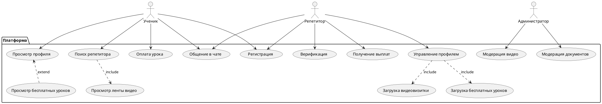

#Use Case Diagram

Описывает взаимодействие ключевых акторов системы

```plantuml

@startuml

actor Ученик as s
actor Репетитор as t
actor Администратор as a

package "Платформа" {
  usecase "Регистрация" as UC1
  usecase "Управление профилем" as UC2
  usecase "Просмотр ленты видео" as UC3
  usecase "Поиск репетитора" as UC5
  usecase "Общение в чате" as UC6
  usecase "Оплата урока" as UC7
  usecase "Загрузка видеовизитки" as UC8
  usecase "Верификация" as UC9
  usecase "Просмотр профиля" as UC10
  usecase "Просмотр бесплатных уроков" as UC11
  usecase "Получение выплат" as UC13
  usecase "Загрузка бесплатных уроков" as UC14
  usecase "Модерация видео" as UC15
  usecase "Модерация документов" as UC16
}

s --> UC1
s --> UC5
s --> UC6
s --> UC7
s --> UC10

t --> UC1
t --> UC2
t --> UC6
t --> UC13
t --> UC9

a --> UC15
a --> UC16

UC10 <.. UC11: extend

UC5 ..> UC3: include
UC2 ..> UC8: include
UC2 ..> UC14: include

@enduml

```

