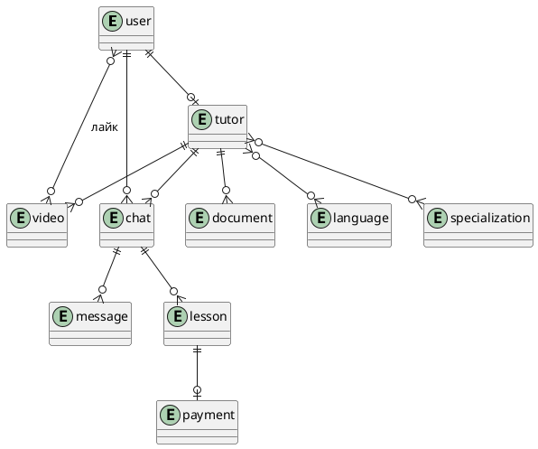
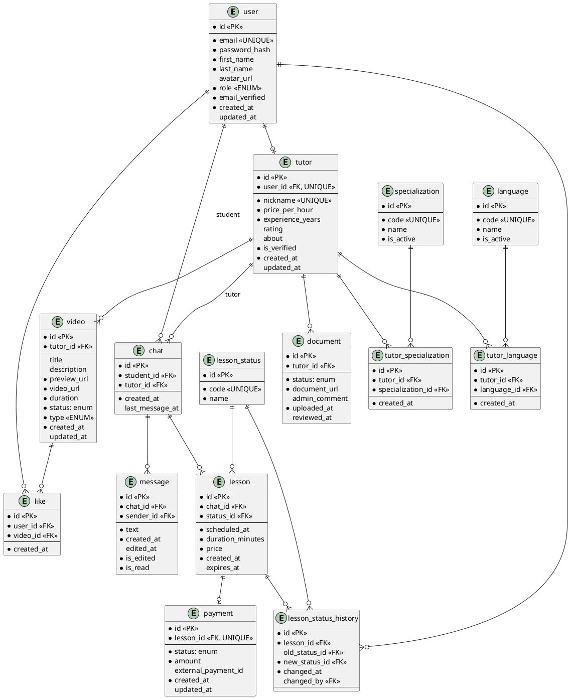
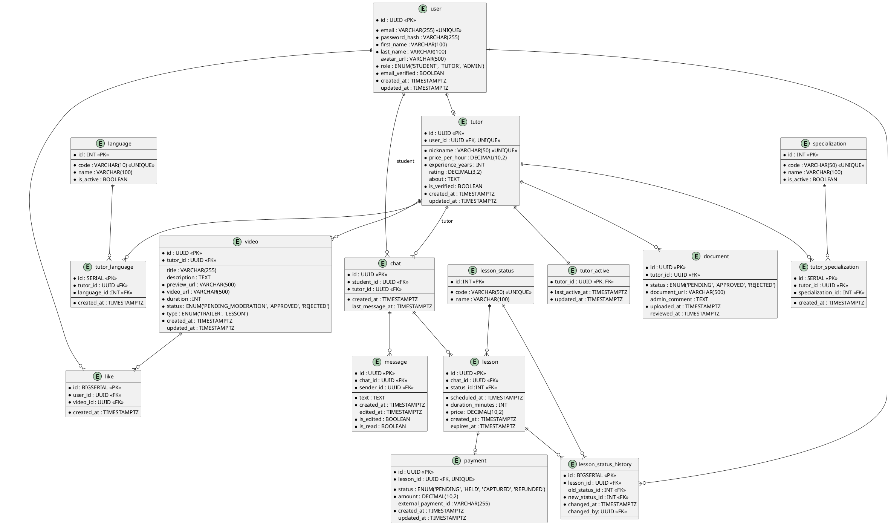

## Концептуальная модель

## Логическая модель

Паттерны, которые были применены: 

**L1. Промежуточные таблицы связей (M:N+)**

Связь M:N: tutor - language. Раскрыта с помощью промежуточной таблицы tutor_language. Репетитор знает много языков, язык знают много репетиторов.

 Связь M:N: tutor - specialization. Раскрыта с помощью промежуточной таблицы tutor_specialization. Репетитор может иметь много спеицализаций, специализация может быть присуща многим репетиторам. 

Связь M:N user - video. Раскрыта с помощью промежуточной таблицы like.  Ученик ставит много лайков, видео получает много лайков. 

Кроме связи, эти таблицы хранят атрибуты самой связи (сreated-at - когда поставлен лайк или добавлена специализация).

**L2. Справочники**

Использовано три справочника: language, specialization и lesson_status_dict. 

**language и specialization**

Нет заранее определенного и точного списка языков и специализаций, закладываем расширение фильтров. Использование справочников позволит бизнесу добавлять новые языки и специализации через административный интерфейс (INSERT) без изменения схемы базы данных и деплоя кода.

**lesson_status_dict**

Статусы урока фиксированы (AWAITING_PAYMENT, PAID, CONFIRMED, COMPLETED, CANCELED, DISPUTED) и могли бы быть ENUM. Однако справочник использован для обеспечения ссылочной целостности с таблицей lesson_status_history - внешние ключи old_status_id и new_status_id ссылаются на конкретный статус и гарантируют, что в историю не попадёт несуществующий статус.

Статусы video (PENDING_MODERATION, APPROVED, REJECTED), payment (PENDING, HELD, CAPTURED, REFUNDED) и document (PENDING, APPROVED, REJECTED) реализованы как ENUM. Их набор фиксирован бизнес-логикой, не требует динамического расширения, и на них не ссылаются другие таблицы через внешние ключи.

**L3. История изменений** 

Паттерн применен для таблицы lesson, так как для аналитики, разрешения спорных ситуаций и отсдеживания прошлых статусов необходимо хранить все эти данные. Должны знать, когда произошла смена статуса и кто инициатор (ученик, репетитор или система по таймауту). Создана таблица lesson_status_history.

**L5. Подтипы сущностей** 

Есть общая сущность user c общими полями. Типы объектов ученик, репетитор, администратор имеют общие поля, но репетитор имеет много уникальных атрибутов. Если бы оставили все данные о репетиторе в таблице user, при описании других типов присутствовало большое количество null столбцов.

Базовая таблица: user, табдлица подтипа: tutor. Связаны как 1:N - user может быть репетитором (не обязательно), но репетитор обязательно должен быть user.

## Физическая модель

Примененные паттерны: 

**P1. Разделение горячих данных** 

Поле last_active_at в таблице tutor обновляются при каждом действии репетитора (открытие чата, загрузка видео, ответ ученику). Хранение в таблице tutor приводит к тому, что каждое обновление блокирует всю строку, создавая конкуренцию с параллельными чтениями профиля учениками.

Горячие поля вынесены в отдельную таблицу tutor_active, связанную с tutor отношением 1:1. Позволяет обновлять статус активности, не затрагивая основную таблицу репетитора.

**Осознанная денормализация**

Денормализация в таблице lesson - поле price. В нормализованной схеме цена должна браться из tutor.price_per_hour по внешнему ключу, но мы сознательно дублируем её в lesson.price, потому что репетитор может изменить свою ставку после того, как ученик создал урок. Если бы мы всегда читали актуальную цену из таблицы репетитора, то при оплате ученик увидел бы новую цену вместо той, по которой бронировал урок, а в финансовых отчётах за прошлые периоды появились бы искажения. Поэтому при создании урока мы копируем текущее значение из tutor price_per_hour в lesson.price, и в дальнейшем эта цена никогда не перезаписывается - это осознанное нарушение 3NF в модели.

